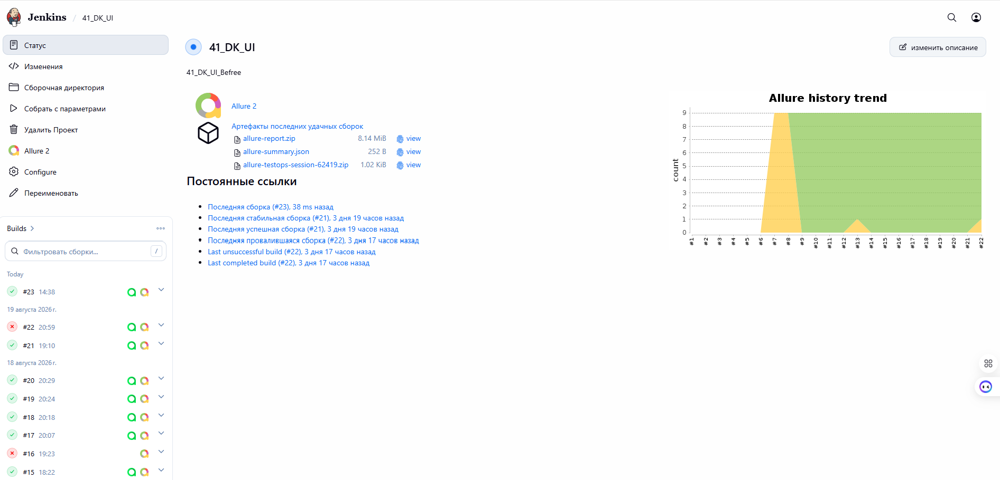
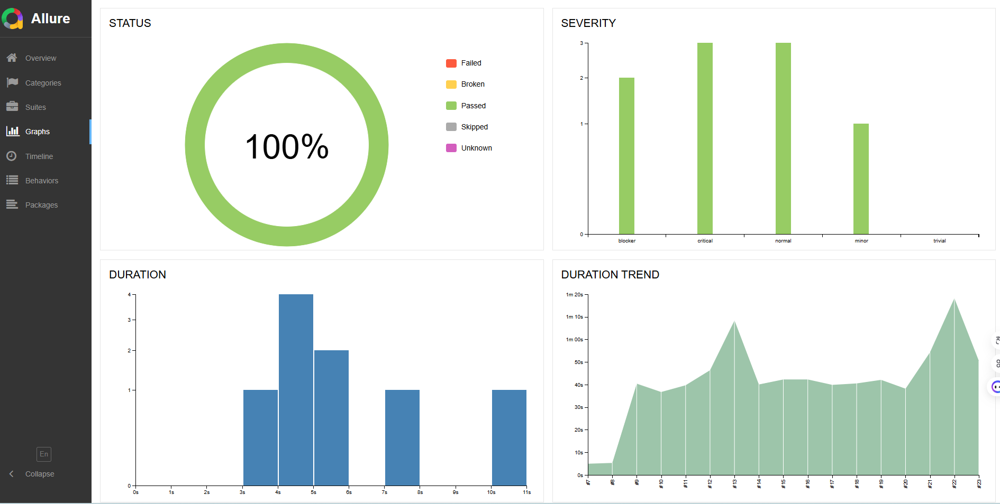
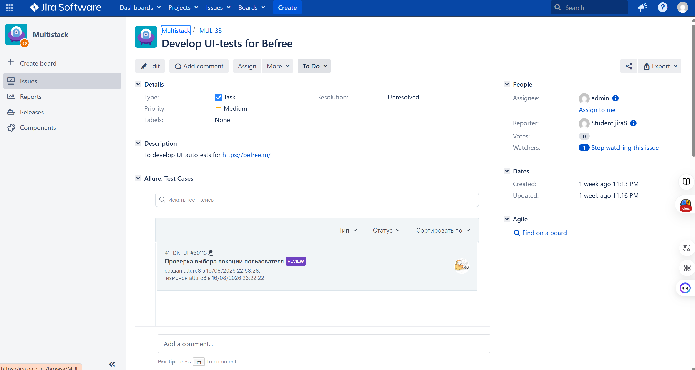
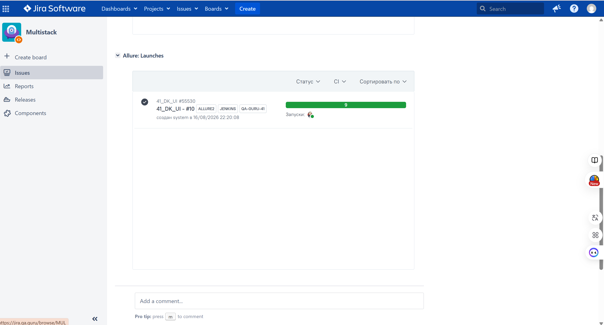
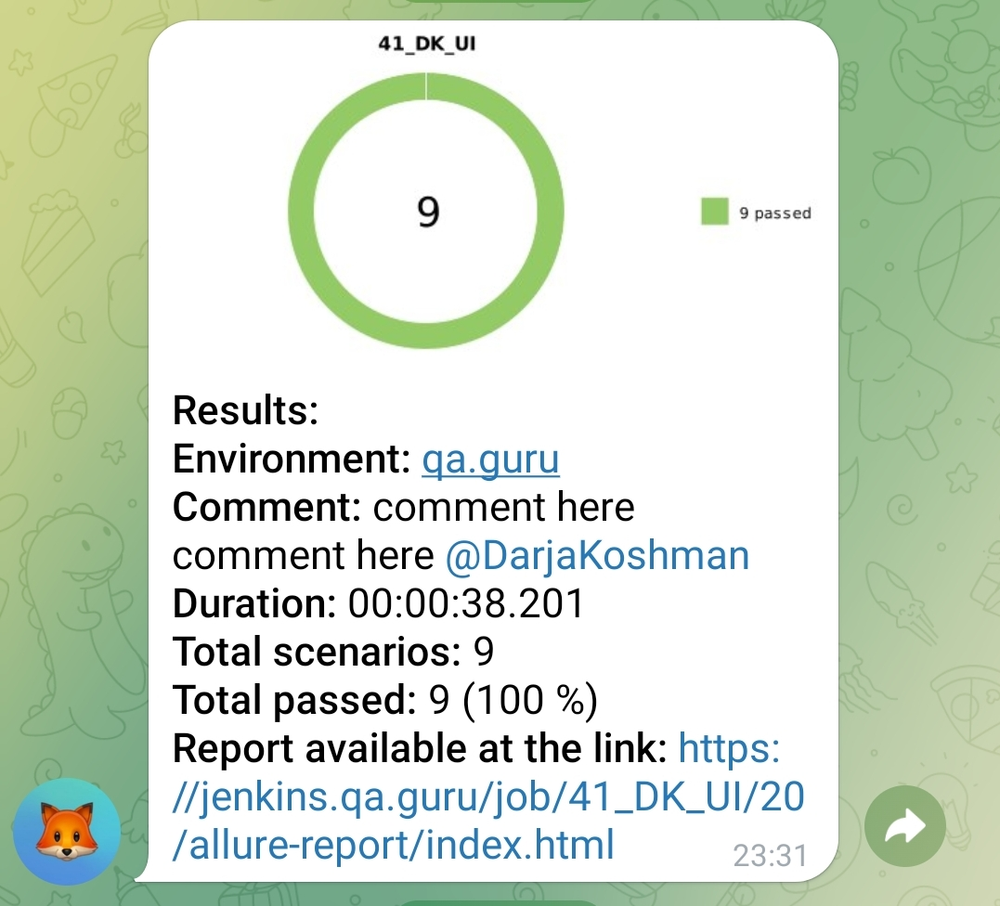

<div align="center">
  <h1 style="color: #1BA8A8;">
    Дипломный проект по автоматизации тестирования сайта <br> 
    <a href="https://befree.ru/" target="_blank" style="color: inherit; text-decoration: none;">
      👗 BEEFREE
    </a>
  </h1>
</div>

## <span style="color: #1BA8A8;">☑️</span> Содержание

- Технологии и инструменты
- Список проверок, реализованных в тестах
- Запуск тестов (сборка в Jenkins) / терминал
- Allure-отчет
- Интеграция с Allure TestOps
- Интеграция с Atlassian Jira
- Уведомление в Telegram о результатах прогона тестов

<a id="tools"></a>
## :ballot_box_with_check:Технологии и инструменты

| Java                                                                                                      | IntelliJ  <br>  Idea                                                                                               | GitHub                                                                                                     | JUnit 5                                                                                                           | Gradle                                                                                                     | Selenide                                                                                                         | Selenoid                                                                                                                  | Allure <br> Report                                                                                                         |  Jenkins                                                                                                        |   Jira                                                                                                              | Telegram                                                                                                            |Allure <br> TestOps                                                                                                          
|:----------------------------------------------------------------------------------------------------------|--------------------------------------------------------------------------------------------------------------------|------------------------------------------------------------------------------------------------------------|-------------------------------------------------------------------------------------------------------------------|------------------------------------------------------------------------------------------------------------|------------------------------------------------------------------------------------------------------------------|---------------------------------------------------------------------------------------------------------------------------|----------------------------------------------------------------------------------------------------------------------------|-----------------------------------------------------------------------------------------------------------------|---------------------------------------------------------------------------------------------------------------------|---------------------------------------------------------------------------------------------------------------------|----------------------------------------------------------------------------------------------------------------------------------:|
| <a href="https://www.java.com/"></a>  | <a href="https://www.jetbrains.com/idea/"></a> | <a href="https://github.com/"></a> | <a href="https://junit.org/junit5/"></a> | <a href="https://gradle.org/"></a> | <a href="https://selenide.org/"></a> | <a href="https://aerokube.com/selenoid/"></a> | <a href="https://github.com/allure-framework"></a> |<a href="https://www.jenkins.io/"></a> | <a href="https://www.atlassian.com/software/jira/"></a> | <a href="https://web.telegram.org/"></a> |<a href="https://qameta.io/"></a> |

<a id="cases"></a>
## :ballot_box_with_check: Реализованные проверки

- Проверка хэдера на главной странице
- Поиск товара через строку поиска
- Открытие корзины
- Переход в каталог 'Женское' с главной страницы
- Проверка отображения списка товаров в каталоге
- Открытие страницы товара из каталога
- Проверка пустой корзины при переходе с главной
- Добавление товара в корзину
- Удаление товара из корзины


##  Сборка в [Jenkins](https://jenkins.qa.guru/view/java-students/job/41_DK_UI/)

<p align="center">  
</a>  
</p>


## :ballot_box_with_check: Параметры сборки в Jenkins:

- browser (браузер, по умолчанию chrome)
- browserVersion (версия браузера, по умолчанию 128.0)
- browserSize (размер окна браузера, по умолчанию 1920x1080)


## Команда для запуска из терминала

Удаленный запуск с использованием Jenkins+Selenoid(требуется логин и пароль):
```bash  
clean test -Denv=ci
```


## </a>  <a name="Allure"></a>Allure Report	</a>


## Основная страница отчёта

<p align="center">  
  
</p>  

## Сьюты

<p align="center">  
  
<p align="center">  
  

</p>

## Graphs

<p align="center">  
  
</p>


##  </a>Интеграция с Allure TestOps</a>

## Allure TestOps Запуски

<p align="center">  
  
</p>  

## Авто и Ручные тест-кейсы

<p align="center">  
   
</p>

## </a> Интеграция с <a target="_blank" href="https://jira.qa.guru/browse/MUL-33">Jira</a>

<p align="center">  
  
</p>
<p align="center">  
  
</p>

____
## </a> Уведомление в Telegram при помощи бота
____
<p align="center">  
  
</p>
